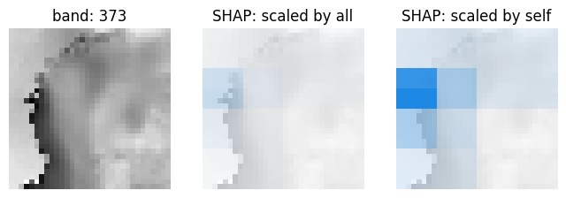

# xai-raster-vis-tools

Scripts for visualizing (rows, columns, channels) outputs of XAI methods.

# Data formats

This repo is very much a work in progress.
Each of the tools should support both `.npz` and `.pickle` files (see below), 
but I am currently only working with the `.pickle` files and have not supported `.npz`. 

**Raw raster values (`.npz`)**

A saved numpy array whose values are the explanation generated by the XAI method.

Shape is either (rows, columns, channels) or (instances, rows, columns, channels)

Example generation:

    COMING SOON!!

**SHAP output object (`.pickle`)**

A saved explanation object produced using the `SHAP` library (https://github.com/slundberg/shap).

Example generation:

    import shap 
    ...
    shap_values = explainer(cubesShap, max_evals=maxEvals, batch_size=64)
    with open(outFile, 'wb') as f:
        pickle.dump(shap_values, f)

# Sample data

Sample XAI outputs available in `sample_data/` to try out the tools. 

**`fog_misses.pickle`**

- what: fog prediction misses (model: FogNet by Kamangir et al.)
- shape: (instances = 5, rows = 32, cols = 32, channels = 385)

    Kamangir, H., Collins, W., Tissot, P., King, S. A., Dinh, H. T. H., Durham, N., & Rizzo, J. (2021). 
    FogNet: A multiscale 3D CNN with double-branch dense block and attention mechanism for fog prediction. 
    Machine Learning with Applications, 5, 100038.

# Setup virtual environment & libraries

    python3 -m venv venv
    source venv/bin/activate

    pip install --upgrade pip
    pip install wheel
    pip install pyvista matplotlib shap

# Tools

**`plot-3D.py`**

Plots a single instance with an interactive 3D viewer. 

    # Example: .npz
    COMING SOON!!

    # Example: .pickle
    python plot-3D.py \
        -p sample_data/fog_misses.pickle \  # Path to pickled SHAP output
        -i 0 \                              # Instance
        -c 0                                # Class

**`plot-2D.py`**

For a single instance, plots a set of selected channels as separate 2D plots. 

    

**`local2global-naive.py`**

Combines and visualizes a set of XAI outputs, so long as all have the same (rows, columns, channels). 
Naive because it assumes all share same spatial location/structure. 
For example, each instance is a fog predictor but for a uniform spatial region.

