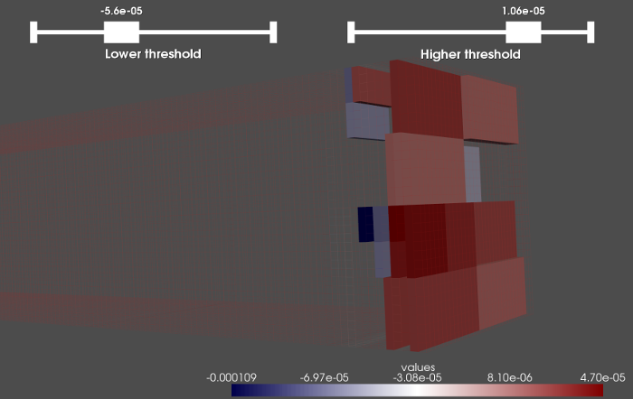
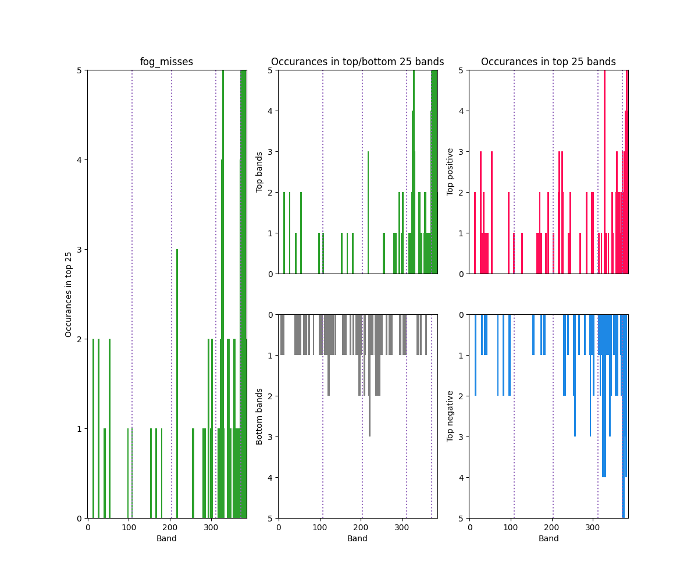

# xai-raster-vis-tools

Scripts for visualizing (rows, columns, channels) outputs of XAI methods.

# Data formats

This repo is very much a work in progress.
Each of the tools should support both `.npz` and `.pickle` files (see below), 
but I am currently only working with the `.pickle` files and have not supported `.npz`. 

**Raw raster values (`.npz`)**

A saved numpy array whose values are the explanation generated by the XAI method.

Shape is either (rows, columns, channels) or (instances, rows, columns, channels)

Example generation:

    COMING SOON!!

**SHAP output object (`.pickle`)**

A saved explanation object produced using the `SHAP` library (https://github.com/slundberg/shap).

Example generation:

    import shap 
    ...
    shap_values = explainer(cubesShap, max_evals=maxEvals, batch_size=64)
    with open(outFile, 'wb') as f:
        pickle.dump(shap_values, f)

# Sample data

Sample XAI outputs available in `sample_data/` to try out the tools. 

**`fog_misses.pickle`**

- what: fog prediction misses (model: FogNet by Kamangir et al.)
- shape: (instances = 5, rows = 32, cols = 32, channels = 385)

    Kamangir, H., Collins, W., Tissot, P., King, S. A., Dinh, H. T. H., Durham, N., & Rizzo, J. (2021). 
    FogNet: A multiscale 3D CNN with double-branch dense block and attention mechanism for fog prediction. 
    Machine Learning with Applications, 5, 100038.

# Setup virtual environment & libraries

    python3 -m venv venv
    source venv/bin/activate

    pip install --upgrade pip
    pip install wheel
    pip install pyvista matplotlib shap

# Main tools

## `plot-3D.py`

Plots a single instance with an interactive 3D viewer. 

    # Example: .npz
    COMING SOON!!

    # Example: .pickle
    python plot-3D.py \
        -p sample_data/fog_misses.pickle \  # Path to pickled SHAP output
        -i 0 \                              # Instance
        -c 0                                # Class

## `plot-2D.py`

For a single instance, plots a set of selected channels as separate 2D plots. 

    # Example: .npz
    COMING SOON!!

    # Example: .pickle
     python plot-2D.py \
        -p sample_data/fog_misses.pickle \  # Path to pickled SHAP output
        -i 0 \                              # Instance
        -c 0 \                              # Class
        -b 370,371,372,373 \                # Selected band indices (starts from 0!)
        --band_names A,B,C,D \              # Descriptive names of each selected band
        -o test.png                         # Outplot plot

## `local2global-naive.py`

Combines and visualizes a set of XAI outputs, so long as all have the same (rows, columns, channels). 
Naive because it assumes all share same spatial location/structure. 
For example, each instance is a fog predictor but for a uniform spatial region.

## `getTopBands.py` & `animateTopBands.bash`

These scripts are for channel-wise (band-wise) analysis.
To score the bands, their __maximum value__ of the XAI output in that band's cells are used. 

The `getTopBands.py` script sorts the channels based on their occurance in the top `k` results.
That is, if **band X** occurs 5 times in the **top 25** and **band Y** occurs 3 times,
then **band X** is ranked higher than **band Y**. It produced the following outputs. 
Both the results using the signed XAI values and their absolute value are reported. 

- `csv`: a sorted list of all bands based on number of occurances in top `k`, both for signed and absolute values
- `png`: a plot of how many times each band occured in the top `k`

The `animateTopBands.bash` script is used to produce plots for `k = 1, ... `,
that serve as the frames of an animation that shows the effect of increasing `k`. 

    # Example:
    python getTopBands.py \
        --num_bands 25 \                                         # Number of 'top bands' (k)
        --pickled_shap sample_data/fog_misses.pickle \           # Path to pickled SHAP output
        --class_name fog_misses \                                # Name of class (for plot)
        --groups 108,204,312,372 \                               # (optional) indices to draw dividers on plot
        --band_descriptions sample_data/fognet_band_names.txt \  # (optional) Path to file with names of bands
        --output_file sample_data/fog_misses_top25.csv \         # Path to save output csv
        --image_file sample_data/fog_misses_top25.png            # Path to save output plot

    # Example output CSV:
    head -n 6 sample_data/fog_misses_top25.csv
    fog_misses_shap_band,fog_misses_shap_desc,fog_misses_shap_abs_band,fog_misses_shap_abs_desc
    329,G4_VVEL_950m_t1,375,G5_TMPDP_t3
    383,G5_DPTSS_t3,329,G4_VVEL_950m_t1
    378,G5_TMPSS_t2,383,G5_DPTSS_t3
    372,G5_TMPDP_t0,377,G5_TMPSS_t1
    329,G4_VVEL_950m_t1,375,G5_TMPDP_t3

# Minor utilities

## `shap_merge.py`

Given a list of pickled SHAP outputs, combine into single pickled SHAP output. 

## `shap_split.py`

Given a single pickled SHAP output and a list of indices, save only those indices as new pickled SHAP output.

